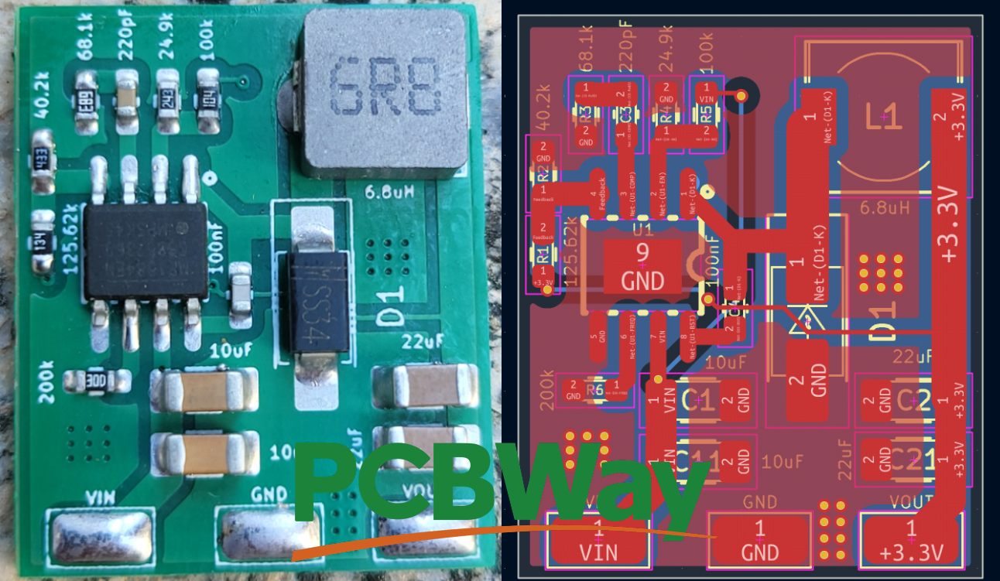
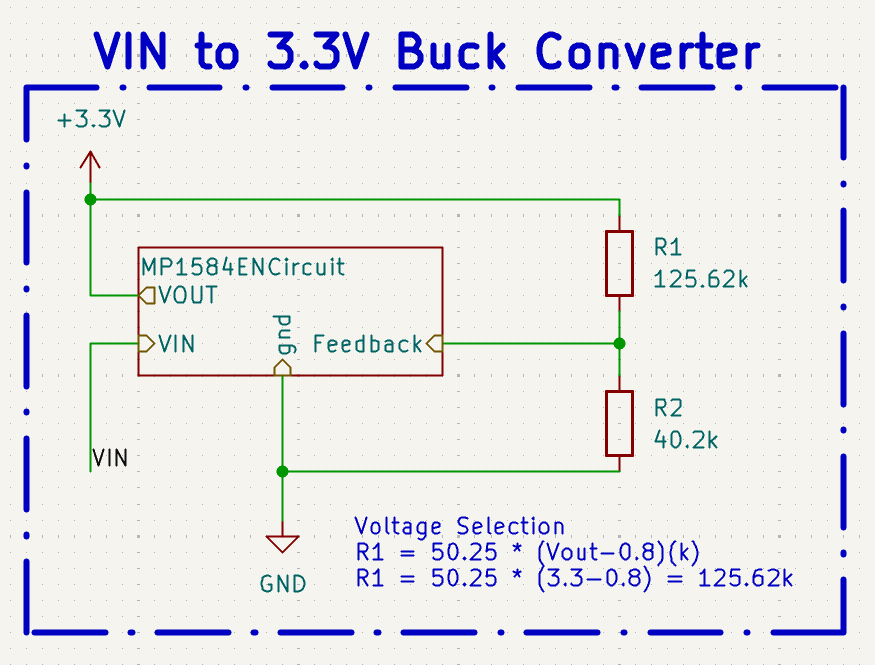
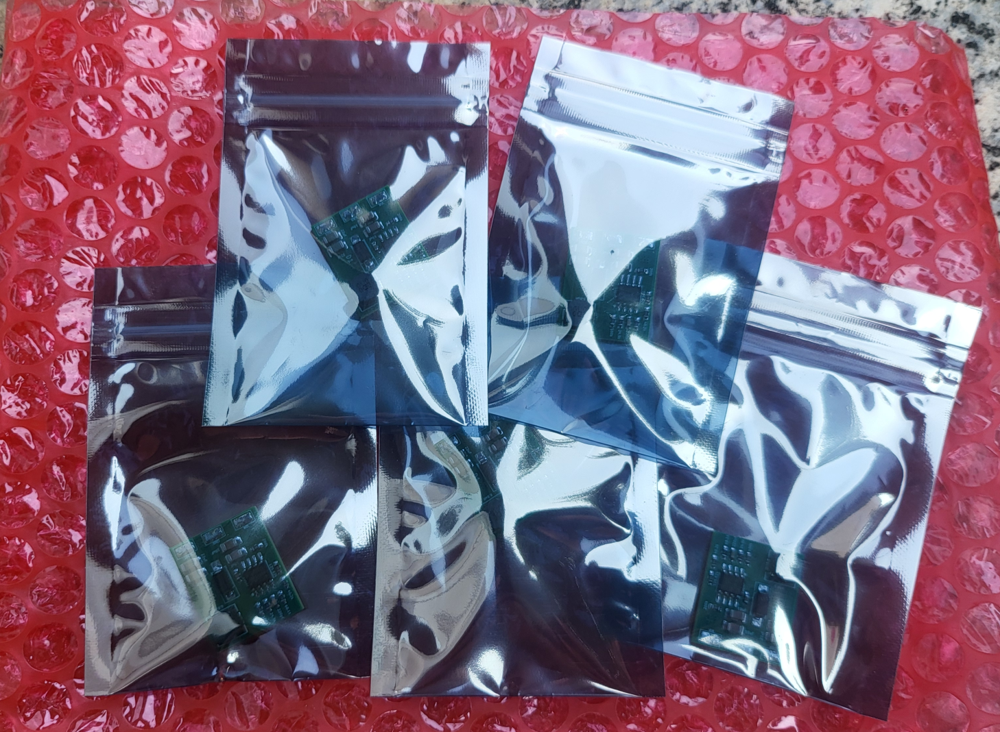
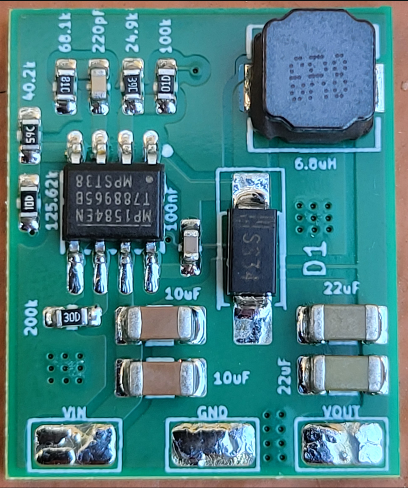
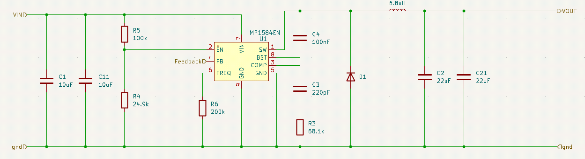

# MP1584EN KiCad Template & Module

  

 Project sponsored by <a href="https://www.pcbway.com/">PCBWay</a> 

This project provides a custom PCB layout for the MP1584EN switching regulator, inspired by the manufacturer's recommended reference design while incorporating layout improvements to enhance performance, manufacturability, and ease of integration.

The board can be fabricated and used as a standalone buck converter module, or the circuit can be embedded directly into your own PCB designs to efficiently step down input voltages for embedded and electronic applications.

## Module Features

* Input Range: 7.5V to 28V (See Module Design Notes - Enable Threshold)
* Max Current: 3A at the Output
* Measured Quiescent Current: 200μA

This design targets a 3.3V output and can be easily adapted to other output voltages by modifying the feedback network.

## Integrate the module in your PCB project

  

This project uses a hierarchical sheet structure to make the converter easy to reuse and configure. Parameters such as the feedback resistors (R1 and R2) can be adjusted directly from the parent schematic.

The recommended integration method is to import the converter as a hierarchical sheet and connect the VIN, VOUT, and GND signals. For PCB integration, simply update the hierarchical sheet path to point to the module schematic.

You also need to import the MP1584EN footprint library included in this repository.

## Setting the Output Voltage

The output voltage is set using the R1/R2 feedback divider connected to the FB pin. A typical design uses **R2 = 40.2kΩ**, while **R1** can be calculated as:

R1 = 50.25 × (VOUT - 0.8) kΩ

For example, a 3.3V output requires an R1 value of approximately 125kΩ.

In most applications, the resistor values do not need to be exact, as small deviations will only result in a minor change in the output voltage.

## PCB Manufacturing & Assembly

Although the board can be assembled by hand, **professional SMT assembly is highly recommended** due to the small SMD package sizes and the exposed thermal pad of the MP1584EN.

The prototype boards featured in this repository were professionally manufactured and assembled by [PCBWay](https://www.pcbway.com/), who kindly sponsored the PCB fabrication and SMT assembly for this project. The boards arrived securely packaged in bubble wrap, with each assembled PCB individually sealed in an anti-static bag to protect them during shipping.

  
  

The boards arrived much faster than I expected and the overall build quality was excellent. The PCB finish is clean, component placement is precise, and the soldering quality made it possible to start testing the hardware immediately without any rework. From uploading the Gerber files to receiving the assembled boards, the entire process was straightforward and required very little manual intervention.

For projects using compact SMD components such as the MP1584EN, the [PCBWay](https://www.pcbway.com/) professional PCBA service is an excellent option to save time and obtain reliable prototypes.

### Testing the Assembled Boards

The assembled boards were successfully tested and performed exactly as expected. All tested units powered up correctly on the first attempt and provided a stable 3.3 V output. During load testing, the converter was able to deliver a continuous 3 A output while maintaining stable regulation. Throughout the test, no excessive heating of the PCB or assembled components was observed under normal operating conditions, demonstrating the effectiveness of both the PCB layout and the professional SMT assembly.

## Manual assembly

Due to the size of the components, **reflow soldering with solder paste is the recommended manual assembly method**. The PCB footprint has been designed with sufficiently large pads, allowing solder paste to be applied manually in most cases without the need for a stencil.

With enough patience, good flux, and a fine-tip soldering iron, the board can also be assembled by hand, although reflow soldering will generally provide the best results.

**Watch the soldering process** [here](assets/20260602_181943_MP1584EN-Soldering.mp4)

## Bill of Materials

| Reference | Value          | Description                     |
| --------- | -------------- | ------------------------------- |
| U1        | MP1584EN       | 3A Step-Down Buck Converter     |
| L1        | 6.8µH         | Power Inductor                  |
| D1        | Schottky Diode | 3A, ≥40V                       |
| C1, C11   | 10µF          | Input Ceramic Capacitors        |
| C2, C21   | 22µF          | Output Ceramic Capacitors       |
| C3        | 220pF          | Compensation Capacitor          |
| C4        | 100nF          | Bootstrap Capacitor             |
| R3        | 68.1kΩ        | Compensation Resistor           |
| R4        | 24.9kΩ        | Enable Divider Resistor         |
| R5        | 100kΩ         | Enable Divider Resistor         |
| R6        | 200kΩ         | Frequency Set Resistor          |
| R1        | 125.62kΩ      | Feedback Resistor (3.3V Output) |
| R2        | 40.2kΩ        | Feedback Resistor (3.3V Output) |

> **Note:** R1 and R2 determine the output voltage and may need to be adjusted for output voltages other than 3.3V.

## Module Design Notes

### Enable Threshold

The Enable Pin is driven by a voltage divider formed by resistors R4 and R5 allowing the module to only start when the supply voltage is greater than ≈ 7.5V.

### Inductor Selection

A 6.8µH inductor was selected as a good compromise between output ripple, transient response, component size, and efficiency. This value is also recommended by the MP1584 datasheet for typical 3.3V output applications.

### Capacitor Selection

The design uses two 10µF ceramic capacitors at the input and two 22µF ceramic capacitors at the output, providing a total capacitance of 20µF and 44µF respectively. Compared to the reference designs in the MP1584 datasheet, which typically use a single 10µF input capacitor and a single 22µF output capacitor, these values provide additional filtering margin and improved transient performance.

Using multiple capacitors in parallel also reduces the effective ESR and ESL, resulting in lower input and output voltage ripple, improved stability, and better high-frequency decoupling.

For output voltages other than 3.3V, refer to the MP1584 datasheet for the recommended inductor, output capacitor, and compensation component values.

### Circuit Design

## Project Sponsor

  

The PCBs and PCBA assembly used for this project were kindly sponsored by **PCBWay**.

The boards shown in this repository were manufactured and assembled by PCBWay. Their support helped validate the design using professionally assembled hardware.

The design, documentation, testing and opinions expressed in this repository are entirely my own.

If you are looking for PCB manufacturing or SMT assembly for your own projects, you can check them out at **https://www.pcbway.com/**.

## License

This project is licensed under the MIT License.

THE SOFTWARE AND HARDWARE DESIGN ARE PROVIDED "AS IS", WITHOUT WARRANTY OF ANY KIND, EXPRESS OR IMPLIED, INCLUDING BUT NOT LIMITED TO THE WARRANTIES OF MERCHANTABILITY, FITNESS FOR A PARTICULAR PURPOSE, AND NONINFRINGEMENT.
